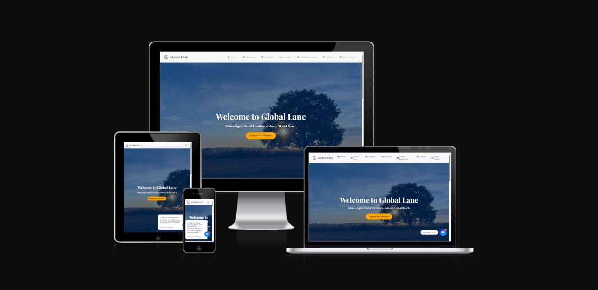

<p align="center">
  
</p>

# Global Lane Website

Welcome to the official repository for the **Global Lane** website. Global Lane is dedicated to providing high-quality agricultural products worldwide, focusing on sustainability and excellence.

## Table of Contents
- [Overview](#overview)
- [Features](#features)
- [Technologies Used](#technologies-used)
- [Getting Started](#getting-started)
- [Project Structure](#project-structure)
- [How to Contribute](#how-to-contribute)
- [License](#license)

## Overview
This project represents the official website of Global Lane, an agricultural export company. The website showcases products, provides services, offers a client portal, and includes resources for trade. It’s fully responsive and includes features like modal popups, form handling, user authentication, and live chat.

## Features
- **Responsive Design**: Optimized for all devices.
- **User Authentication**: Powered by Clerk for secure login.
- **Form Handling**: Formspree integration for backend-free submissions.
- **Live Chat**: Tawk.to for real-time visitor communication.
- **Google Analytics**: For tracking user interactions.
- **Modal Popups**: Enhanced user experience with popups for forms and confirmations.

## Technologies Used
- **Frontend**:
  - **HTML5**: Structure and content.
  - **CSS3**: Styling with Flexbox, animations, and media queries.
  - **JavaScript**: Interactivity, form validation, and third-party integrations.
  - **Bootstrap**: Responsive layouts and pre-built components.
  - **FontAwesome**: Icons for visual elements.
  
- **Third-Party Services**:
  - **Formspree**: For form submissions.
  - **Clerk**: User authentication and profile management.
  - **Google Analytics**: User behavior tracking.
  - **Tawk.to**: Real-time chat integration.

## Getting Started
To set up the project locally, follow these steps:

### Prerequisites
Ensure you have:
- A web browser (e.g., Chrome, Firefox)
- A text editor or IDE (e.g., Visual Studio Code)
- Basic knowledge of HTML, CSS, and JavaScript

### Installation
1. Clone the repository:
   ```bash
   git clone https://github.com/your-username/global-lane-website.git
   cd global-lane-website
/global-lane-website/
├── index.html              # Landing page with hero section and product showcase
├── about.html              # About Us page
├── products.html           # Products page listing agricultural exports
├── services.html           # Services page detailing offerings
├── trade-resources.html    # Trade Resources page with useful info
├── client-portal.html      # Client Portal with authentication
├── contact.html            # Contact Us page with form
│
├── css/
│   └── styles.css          # Main stylesheet
│
├── js/
│   └── scripts.js          # JavaScript for form handling and modals
│
├── images/
│   └── logo.png            # Logo of Global Lane
│   └── thank-you-image.jpg # Image after successful form submission
│
└── README.md               # Project documentation (you are here)
